# 云资产管理工具

## 介绍
目前工具定位是云安全相关工具，目前是两个模块
云存储工具、云服务工具，
云存储工具主要是针对oss存储、查看、删除、上传、下载、预览等等
云服务工具主要是针对rds、ecs服务器的接管、管理，查看、执行命令等等

## 软件架构
electron + vue + element-ui +iviewui+ nodejs + go 等等  

## 目前实现功能
阿里云：接管控制台、取消接管、Oss增删改查、远程命令执行回显、历史命令记录查看、子用户列表、云数据库管理、告警管理  
腾讯云：接管控制台、取消接管、Oss增删改查、远程命令执行回显、子用户列表 
华为云：接管控制台、取消接管、子用户列表 
ucloud：接管控制台、主机查询、子用户列表查看、主用户查看、订单查看 
AWS: 接管控制台、创建后门、子用户列表、策略列表 后门信息 

## 云存储工具模块
<h3>云存储工具-资产列表</h3>
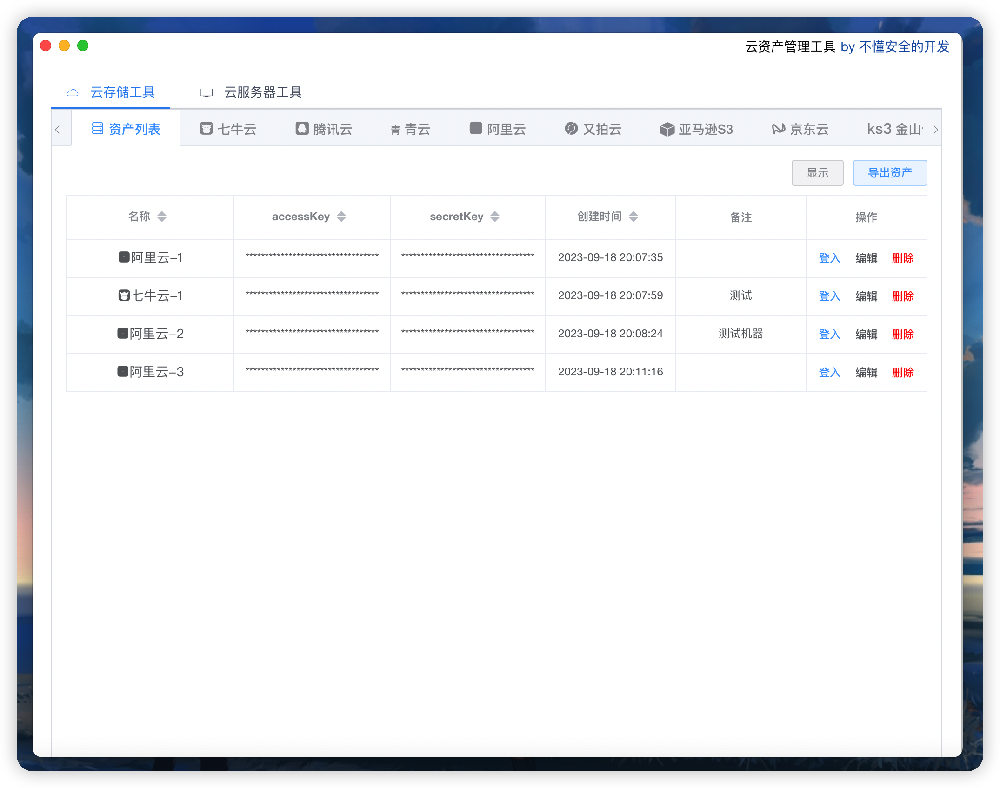
<h3>云存储工具-存储桶信息</h3>
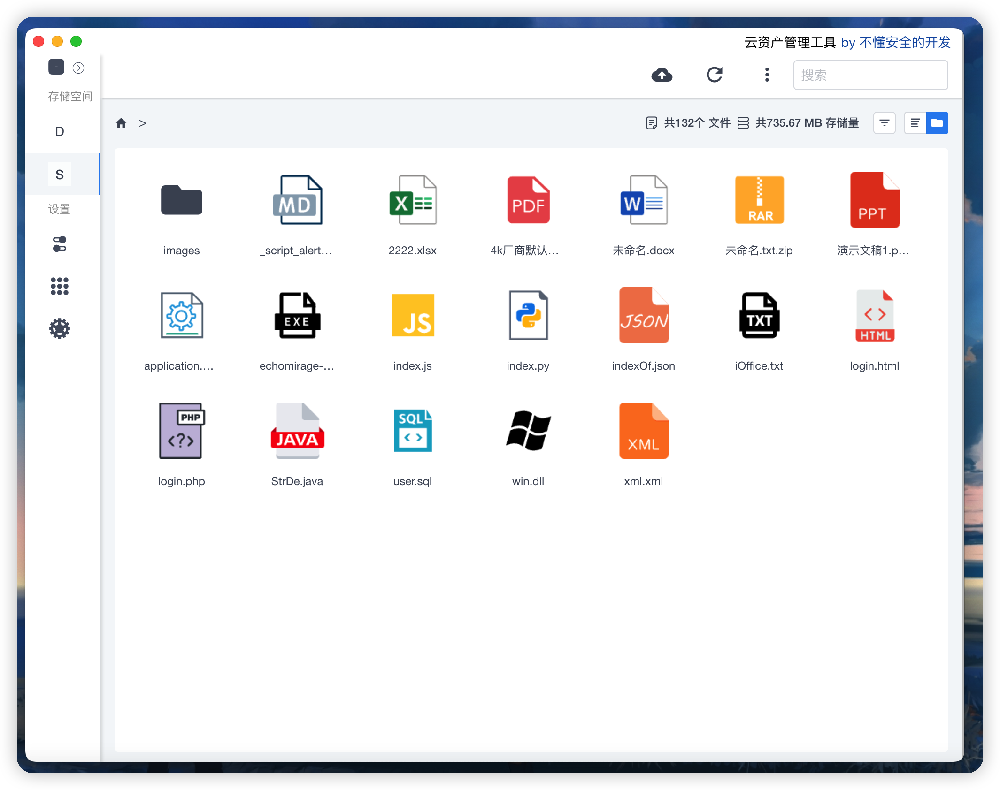
<h3>云存储工具-其他服务</h3>
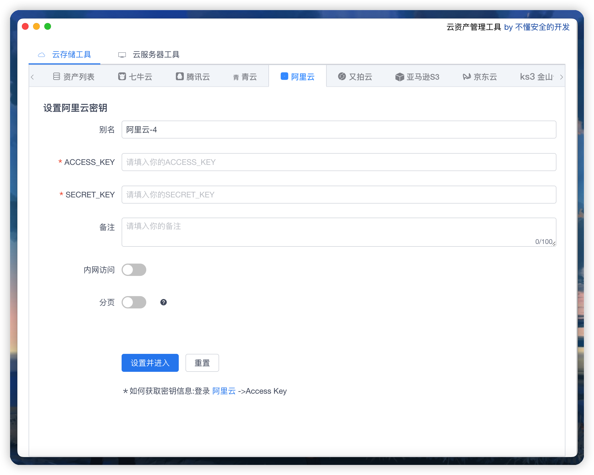

## 云服务器工具模块
<h3>云服务工具-资产列表</h3>
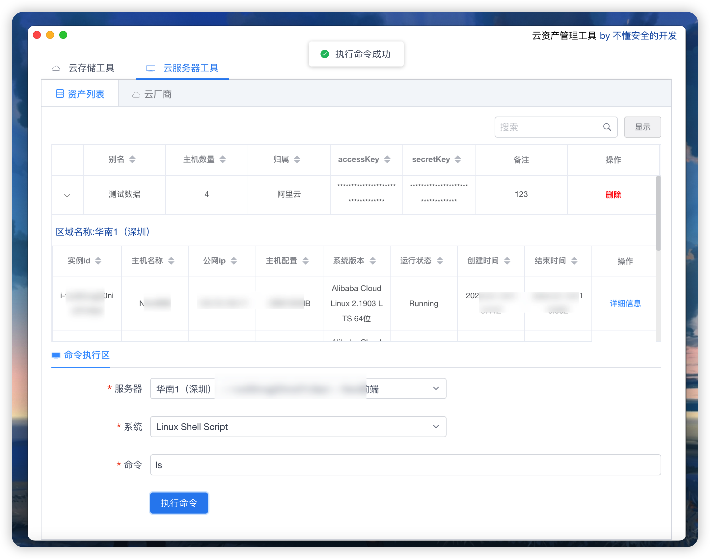
<h3>云服务工具-云厂商</h3>
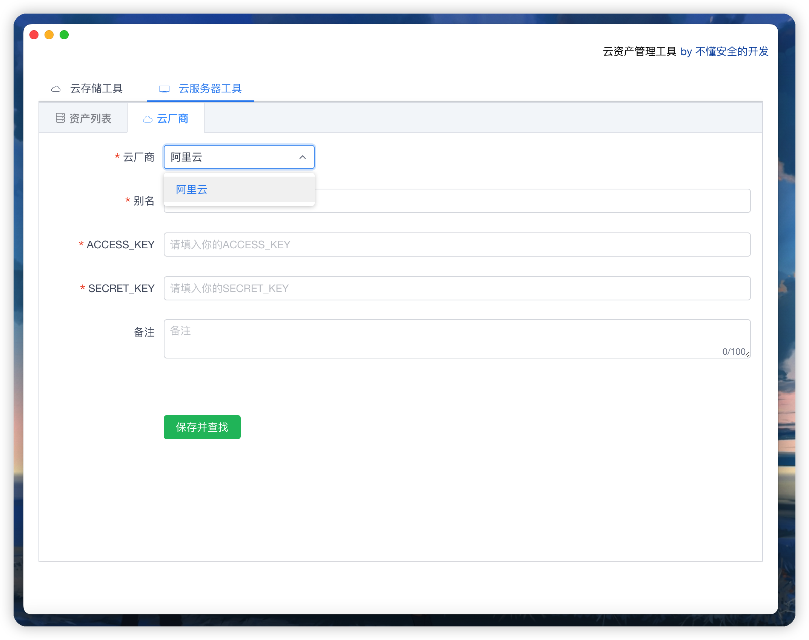
<h3>云服务工具-阿里云命令回显</h3>
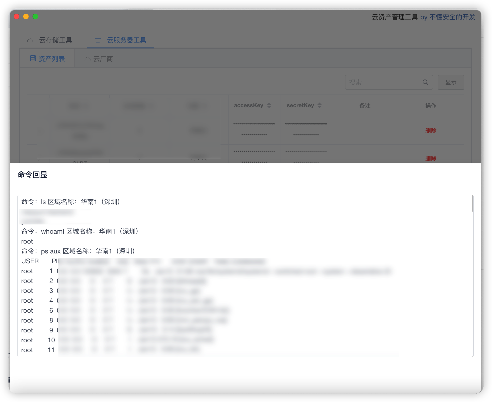
<h3>云服务工具-华为云接管控制台</h3>
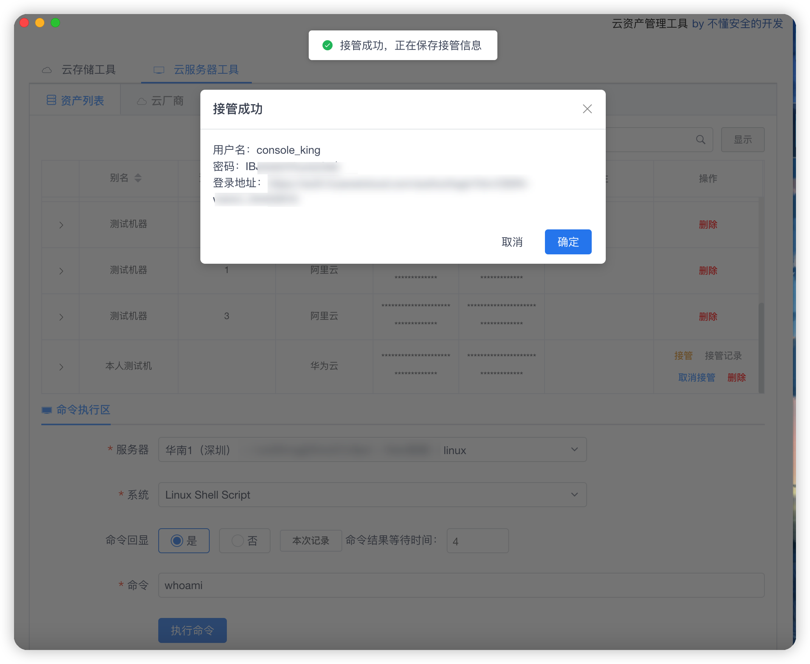
<h3>云服务工具-阿里云数据库管理</h3>
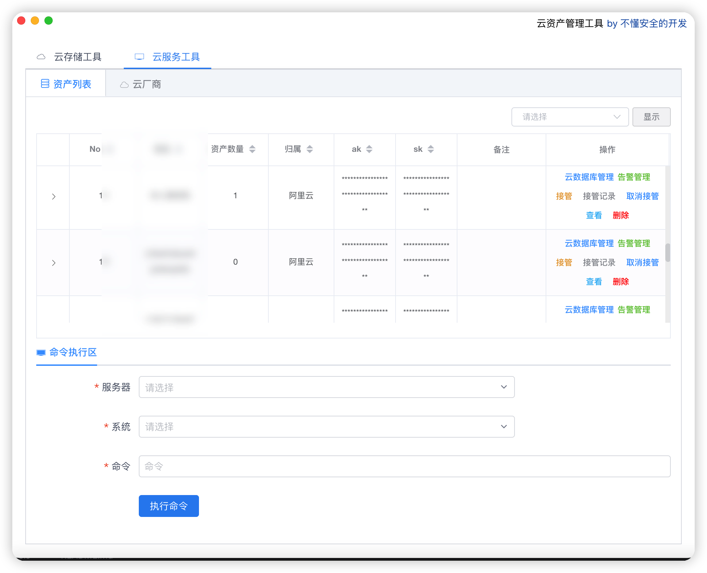
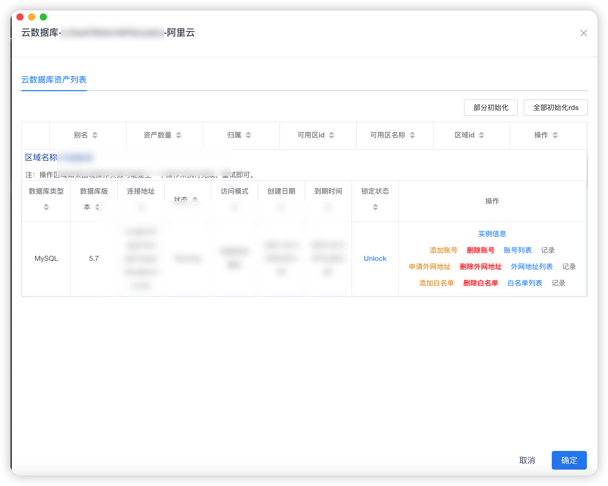
<h3>云服务工具-阿里云告警管理</h3>
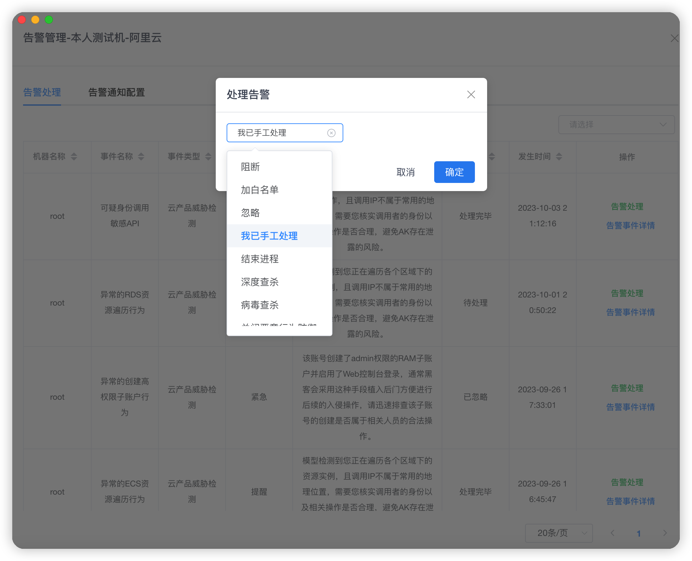
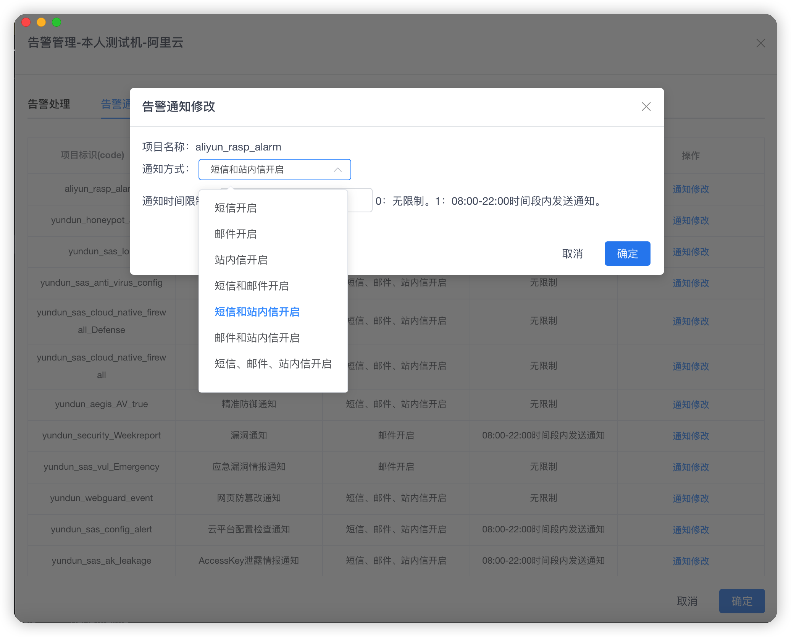
<h3>云服务工具-ucloud相关</h3>
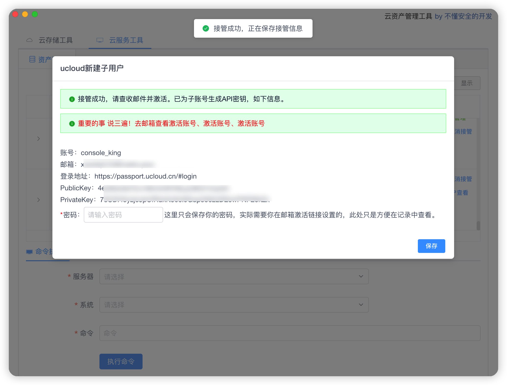
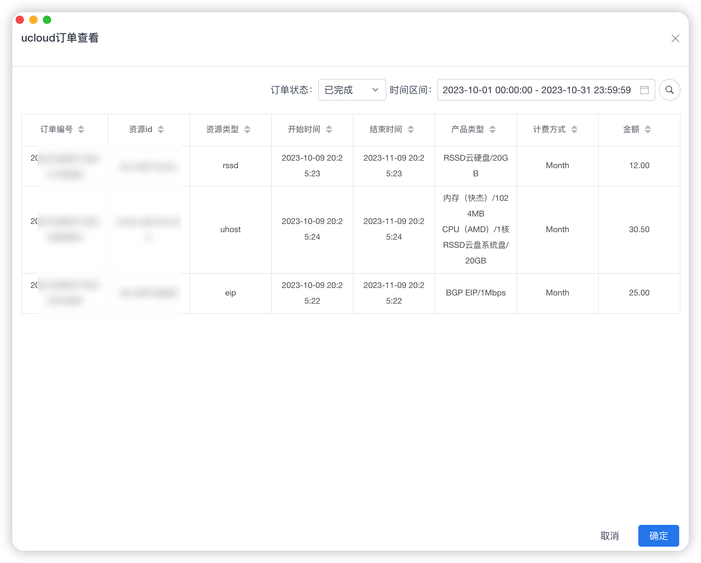

## 交流群
关注公众号：红蓝攻防实验室

## 常见问题
1、mac系统14.1.2可能会出现应用程序"云资产管理工具.app"无法打开。
sudo xattr -rd com.apple.quarantine 将应用在拖到终端
2、mac系统无法正常关闭：
     3.1、电脑最左上角点击软件关闭。
     3.2、command + q 关闭软件。

